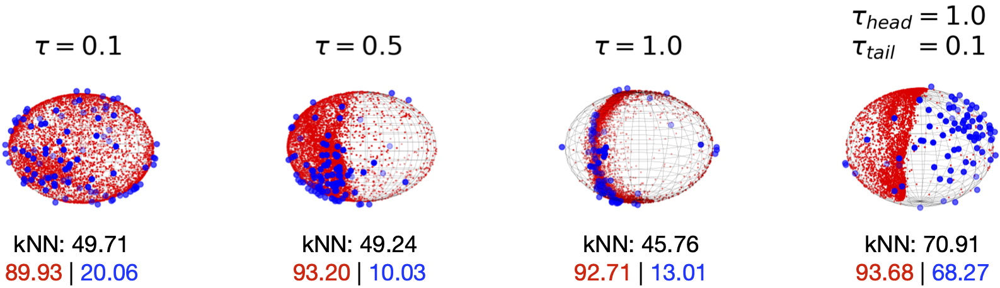

# Temperature Schedules for self-supervised contrastive methods on long-tail data 

[ICLR paper](https://openreview.net/pdf?id=ejHUr4nfHhD)



## Introduction
Most approaches for self-supervised learning (SSL) are optimised on curated balanced datasets, e.g. ImageNet, despite the fact that natural data usually exhibits long-tail distributions. In this paper, we analyse the behaviour of one of the most popular variants of SSL, i.e. contrastive methods, on long-tail data. In particular, we investigate the role of the temperature parameter τ in the contrastive loss, by analysing the loss through the lens of average distance maximisation, and find that a large τ emphasises group-wise discrimination, whereas a small τ leads to a higher degree of instance discrimination. While τ has thus far been treated exclusively as a constant hyperparameter, in this work, we propose to employ a dynamic τ and show that a simple cosine schedule can yield significant improvements in the learnt representations. Such a schedule results in a constant `task switching' between an emphasis on instance discrimination and group-wise discrimination and thereby ensures that the model learns both group-wise features, as well as instance-specific details. Since frequent classes benefit from the former, while infrequent classes require the latter, we find this method to consistently improve separation between the classes in long-tail data without any additional computational cost.  


## Environment
Requirements:
```bash
pytorch 1.7.1 
opencv-python
scikit-learn 
matplotlib
```
Recommend installation cmds (linux)
```bash
conda install pytorch==1.7.1 torchvision==0.8.2 torchaudio==0.7.2 cudatoolkit=10.2 -c pytorch # change cuda version according to hardware
pip install opencv-python
conda install -c conda-forge scikit-learn matplotlib
```


## Pretrained models downloading
CIFAR10: [pretrained models](https://drive.google.com/drive/folders/1lZwkFMpwRg01lYYyaUFB51LUPE6wH8dV?usp=sharing)

CIFAR100: [pretrained models](https://drive.google.com/drive/folders/1TCZfWuT88EEvlMTkVmNTbdKN0NOH1GAR?usp=sharing)

Imagenet100: [pretrained models](https://drive.google.com/drive/folders/1ooa7DveBFuH2zCHg1_WGuCAUCZ6a071R?usp=sharing)

## Evaluation of pretrained models
CIFAR10: [evaluation](notebooks/simclr_tau_cifar10.ipynb)

CIFAR100: [evaluation](notebooks/simclr_tau_cifar100.ipynb)

Imagenet100: [evaluation](notebooks/simclr_tau_imagenet100.ipynb)

## Pretrain models
SimCLR with cosine temperature schedule

### CIFAR10

```bash
torchrun --standalone --nnodes=1 --nproc_per_node=1 train_simCLR.py simclr_TS \
--batch_size 512 \
--optimizer sgd \
--lr 0.5 \
--model res18 \
--scheduler cosine \
--epochs 2000 \
--seed 42 \
--output_ch 128 \
--num_workers 8 \
--adj_tau cos \
--temperature_min 0.1 \
--temperature_max 1.0 \  
--t_max 200 \
--trainSplit cifar10_imbSub_with_subsets/split1_D_i.npy \
--split_idx 1 \
--save-dir ./checkpoints/cifar10-LT/ 

```

### CIFAR100

```bash
torchrun --standalone --nnodes=1 --nproc_per_node=1 train_simCLR.py simclr_TS \
--dataset cifar100 \
--batch_size 512 \
--optimizer sgd \
--lr 0.5 \
--model res18 \
--scheduler cosine \
--epochs 2000 \
--seed 42 \
--output_ch 128 \
--num_workers 8 \
--adj_tau cos \
--temperature_min 0.1 \
--temperature_max 1.0 \  
--t_max 200 \
--trainSplit cifar100_imbSub_with_subsets/cifar100_split1_D_i.npy \
--split_idx 1 \
--save-dir ./checkpoints/cifar100-LT/ 

```

### ImangeNet100

```bash
torchrun --standalone --nnodes=1 --nproc_per_node=1 train_simCLR.py simclr_TS \
--dataset imagenet-100 \
--batch_size 256 \
--optimizer sgd \
--lr 0.5 \
--model res50 \
--scheduler cosine \
--epochs 800 \
--seed 42 \
--output_ch 128 \
--num_workers 8 \
--adj_tau cos \
--temperature_min 0.1 \
--temperature_max 1.0 \  
--t_max 200 \
--imagenetCustomSplit imageNet_100_LT_train \
--split_idx 0 \
--save-dir ./checkpoints/imagenet100-LT/ \
--data ./datasets/ILSVRC2012/

```

## Citation
```
@inproceedings{
kukleva2023temperature,
title={Temperature Schedules for self-supervised contrastive methods on long-tail data},
author={Anna Kukleva and Moritz Böhle and Bernt Schiele and Hilde Kuehne and Christian Rupprecht},
booktitle={ICLR},
year={2023},
url={https://openreview.net/forum?id=ejHUr4nfHhD}
}
```

### Thanks
SimCLR part is based on [SDCLR](https://github.com/VITA-Group/SDCLR) repo  
MoCo will be released soon
